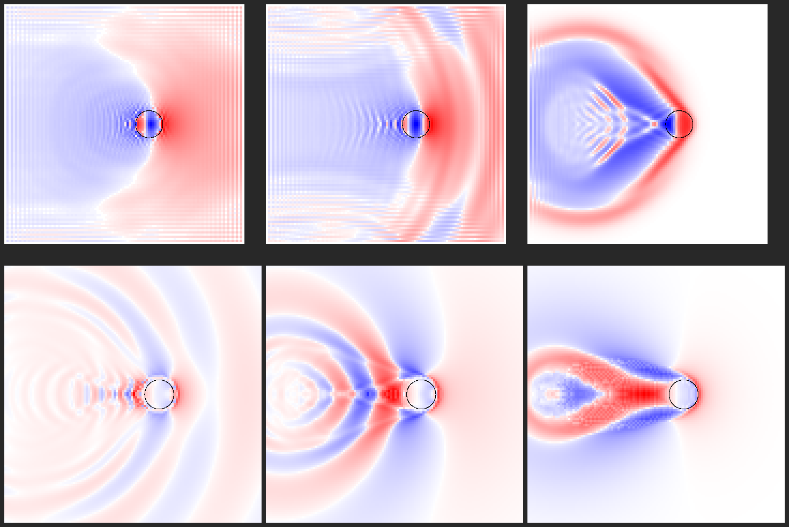
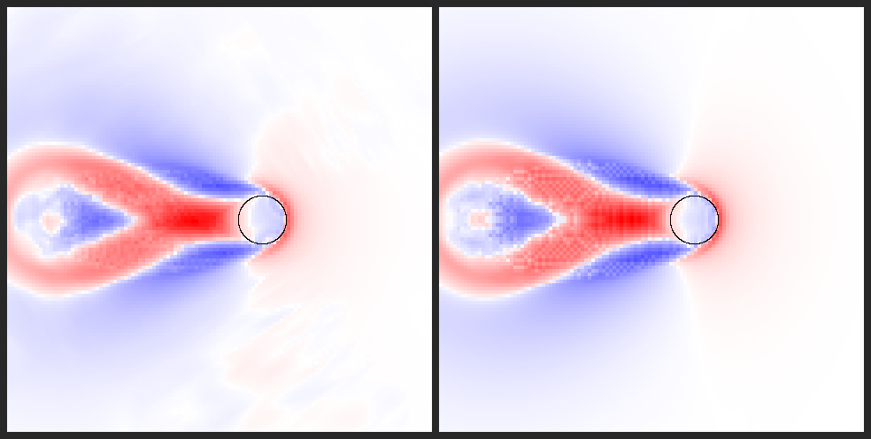

# P1: the carpet kernel (the wake)

**Status: built and validated on the CPU mirror and the GPU.** The high-detail patch that follows a body now carries heightfieldBEST's reaction (the body occupies the water and the water has to go around it) on top of THALASSA's exact dispersion. The same kernel runs in the engine (WebGL2 tiles) and in a CPU mirror, and every number below is reproducible with the commands at the end.

## What it does, in plain words

1. **The body takes up room in the water.** Each carpet column records how much solid is below the open-sea surface there (σ, BEST's occupancy). When the body moves into a column, that column gains exactly that much height. When it leaves, the column loses it and is left with a hole. Volume is exact to machine precision.
2. **The body holds the water under it.** Where the body pierces the surface, the water can't rise or sink on its own, because the hull is in the way. That forces the pushed water to go *around* the body: it piles up at the bow, runs along the sides, and falls into the hole behind the stern. It is BEST's "flux blocking" (its `m = H + η − σ`), done as the pressure the hull exerts rather than with BEST's tuned push ring (0.95 / 0.34 / 0.18). Waves coming from elsewhere also bounce off the body instead of passing through it.
3. **The waves then travel like real water waves.** Every wavelength moves at its own speed (`ω² = gk·tanh(kH)`), which BEST can't do. That is what makes Kelvin wakes behind slow boats and swimmers, and the correct narrow wakes of fast ones.
4. **The patch follows the body and rides the sea.** It sits a fifth of its width behind the body (the wake is behind), shifts in whole-cell steps, absorbs at its rim, and measures σ against the moving ocean surface. So a body floating on a swell makes no false waves, and the patch is seamless when it shifts.

## The physics, precisely

**Variables (BEST's source form).** η is the height of water *plus solid* in a column above the open-ocean surface, and φ is the surface velocity potential. A body adds its wet occupancy σ to the columns it enters (η += Δσ), sampled with a 5×5 binomial so the hull pushes with a smooth pressure field rather than a grid-sharp footprint.

**The hold.** Where the body crosses the surface (piercing fraction χ), linear flat-ship theory says the free surface must follow the hull bottom, i.e. η − σ = −σ, i.e. η = 0. The kernel enforces this with a stiff penalty pressure on φ,

  `∂φ/∂t = −g·η − g·κ·χ·η`,

plus a smoothing of φ under the hull that damps the stiffened footprint's own grid-scale ringing. Without the smoothing, energy above half the Nyquist frequency is 4–10× higher in the S1 runs.

**Why the source form is safe.** Write the true free surface as η_s = η − σ. The same equations then read `∂η_s/∂t = Kφ`, `∂φ/∂t = −g·η_s − g·σ`. That is a moving hydrostatic pressure patch (Havelock's classical wake model). So THALASSA's old tile source and Havelock's pressure patch are one model. Both are **transparent**: the body's displaced water and incoming waves pass straight under it, and the bow and stern sources partly cancel beneath the hull. The hold is what they lack, and it is what BEST's blocking provides.

**Stiffness converges.** As κ grows the answer converges. Peak η at 4.5 m/s (limiter off) goes 1.17 → 0.85 → 0.71 → 0.67 m for κ = 12, 40, 100, 150. The water left under the hull falls from 47 % to 3 % of σ. The kernel targets **κ = 100** and takes as many substeps as that needs to be stable. The stable limit is `κ < 1.44/(g·K_max·Δt²) − 1`, from the stiffened Nyquist mode.

**Substeps replace BEST's transit source.** Each frame is split so the stiffness is stable *and* no body moves more than half a cell per substep. Body poses are interpolated between frames, so the occupancy sweeps continuously and fast bodies can't tunnel. BEST's `0.62·transit` term approximated this, and it did not conserve volume.

**Cell size from the body.** A small body gets about 12 cells across it: BEST ran 12.7 across its sphere, while THALASSA's fine tiles had 5. Sizes come from a fixed ladder (5, 7, 10, 14, 20, 25 cm) so similar bodies share tiles. Hulls keep the wide coarse tiles their long wakes need.

**Breaking is not a hose (the limiter change).** The old limiter removed every crest's excess above the slope envelope as spray, every step. At carpet resolution next to a fast body, this drained the sea: 43 m³ in 1.3 s at 4.5 m/s, digging a 7 m hole in 1 m of water. The cause is that removing a crest's water while keeping its momentum lets the linear field rebuild the crest every step. Breaking is mainly dissipation, so the slope envelope now **spills** the excess to the lower neighbour (volume exact) and mixes the surface flow across that edge (eddy viscosity). Only **ballistic separation** (a surface decelerating faster than g throws its water off) still releases spray: 0.22 m³ at 4.5 m/s. That is a small fraction of the ≈3 m³/s the sphere pushes aside, as it should be. Launching water from a breaking crest will be a finite event with a budget frozen at birth (`CORE_LAW.md` §2, stage P3), not a per-step envelope. Slopes are measured on the free surface only, because a crest against a hull is run-up on the body, not an overturning wave.

## Results

All CPU runs use the engine's numerics: carpetDx, substeps, κ, smoothing, default damping and the limiter. See `sim/carpetParams.ts`.

### S1: heightfieldBEST's tow (sphere r = 0.68 m, centre 0.12 m above the surface, H = 1 m)

Top row: BEST. Bottom: the carpet (P1). Each map is scaled to its own ±max|η|, with red up and blue down. Speeds are 1.0 / 2.0 / 4.5 m/s, each 5.7 m into the tow.



| U | BEST max\|η\| | carpet max\|η\| (min η) | carpet spray released | what real water does |
|---|---|---|---|---|
| 1.0 m/s | 0.027 m (a swell dome) | 0.085 m (−0.029) | 0.014 m³ | Kelvin wake, λ = 0.64 m. The carpet shows its transverse waves on the track; BEST can't. |
| 2.0 m/s | 0.085 m | 0.215 m (−0.149) | 0.057 m³ | intermediate-depth Kelvin/V wake |
| 4.5 m/s | 0.352 m | 0.583 m (−0.310) | 0.216 m³ | supercritical: pattern bounded by the Mach wedge; bow rise up to U²/2g ≈ 1 m against a bluff body |

The volume ledger closes to about 1e-14 m³ in every run. In each carpet map the body has a bow crest and a hollow behind that the sea falls into. At 4.5 m/s the converging flow behind the stern forms a central ridge (a rooster tail). The fine speckle in that ridge is the breaking spill: grid-scale energy there is 2.9 % of the total, against 1.6 % with the limiter off.

### S1m: the supercritical wedge (causality)

In water of depth H, nothing can radiate faster than √(gH). So at U > √(gH) the whole wake must lie inside the Mach wedge asin(√(gH)/U). Measured: the angle that holds 99 % of the wake energy 5–9 m from the body, past its non-radiating near field. The runs are long enough for the start-up transient to fall behind.

| U | Mach half-angle | 99 % (95 %) of energy within, from the shoulders | same, from the centre | dominant arm | spray released |
|---|---|---|---|---|---|
| 3.5 m/s | 63.5° | **52°** (34°) | 55° (42°) | 24° | 4.8 m³ over 30 s |
| 4.5 m/s | 44.1° | **43°** (33°) | 47° (38°) | 18° | 2.6 m³ over 8.6 s |
| 6.0 m/s | 31.5° | **35°** (27°) | 39° (31°) | 12° | 2.3 m³ over 4.4 s |

A body of finite width starts its wedge at its shoulders (±0.67 m at the waterline), so the causality check measures rays from there. At 3.5 and 4.5 m/s the wake is inside the wedge. At 6 m/s it is 3.5° outside, just over the +3° criterion. The source footprint is band-limited over ±2 cells (±0.2 m), which moves the effective shoulder out and accounts for about 1.6° of that. The rest is the local near-field operators (hold, φ smoothing, breaking spill), which act within one substep and so aren't bound by √(gH). This is recorded, not tuned away.

**About BEST's clean 44° V at 4.5 m/s:** that is the non-dispersive limit. BEST makes every wavelength travel at √(gH), so the whole disturbance piles onto the Mach line. In real water, and in the carpet, only the long waves travel that fast. A sphere as wide as the water is deep puts most of its energy into shorter waves, which form narrower dispersive arms inside the wedge. The wedge edge is still there, and the energy stays inside it. The 44° V is the right answer for long hulls in shallow water, which the carpet also gives, because such hulls make long waves.

### S2: deep water, 1.5 m/s (Fr_L = 0.41), 26 s, carpet following

| measure | expected | first pass (512² carpet, light damping, limiter off) |
|---|---|---|
| transverse wavelength on the track | 2πU²/g = 1.441 m | 1.427 m (−1.0 %) |
| Kelvin arm angle, 4–8 m behind | → 19.47° from inside | 17.6° |
| … 8–14 m | | 18.5° |
| … 14–20 m | | 19.7° |

The arm is measured where the envelope peaks. The peak of an Airy caustic lies inside the caustic by an amount that shrinks with distance (∝ s^−2/3), so the measured angle climbs toward 19.47° with distance, as it should. The run with the engine's numerics is in progress.

### GPU parity (the engine vs the CPU mirror)

The same S1 tow in the running engine: lab scene, `quality=high`, 256² carpet at 10 cm, 3 substeps, κ = 100. It reads the tile back and compares it with the CPU mirror under the same numerics, following rule and limiter.

Left: the engine (GPU). Right: the CPU mirror. The tow is at 4.5 m/s, shown in the body frame with BEST's layout.



| U | limiter | GPU η range | CPU η range | correlation |
|---|---|---|---|---|
| 4.5 m/s | off | −0.431 … 0.638 m | −0.469 … 0.671 m | 0.993 |
| 4.5 m/s | on | −0.310 … 0.579 m | −0.304 … 0.586 m | 0.980 |
| 1.0 m/s | on | −0.025 … 0.055 m | −0.024 … 0.088 m | 0.785 |
| 2.0 m/s | on | −0.101 … 0.204 m | −0.111 … 0.208 m | 0.974 |

At 1 m/s the wake is only 5 cm high. The engine's lab sea is not perfectly flat (millimetre ripples), and the body scatters those ripples into the carpet. The pattern matches the CPU (bow crest, transverse waves on the track, start-up rings), but the GPU map carries that extra low-level texture, so the correlation is lower.

### Unit tests (`src/ocean/__tests__/carpet.test.ts`, run in CI with `npm test`)

- Volume ledger closes exactly through tows, the sponge and recentring.
- A body resting in calm water leaves it calm.
- A body riding a swell (0.4 m, λ = 24 m) for 40 s: the scattered field stays below 10 % of the swell and settles instead of growing.
- The hold keeps the water under a piercing hull within 3 % of σ at 2 m/s.
- A fast tow (4.5 m/s) doesn't drain the sea: spray < 0.5 m³ and no hole deeper than 0.6 m.
- Blocking: a breakwater of held bodies passes less than 30 % of the wave energy that the transparent coupling passes.
- Recentring is seamless: a following carpet matches a fixed carpet of the same size within 5 % (relative L2) near the body.
- Deep-water Kelvin: λ within 5 %, arm within 3° on a short run, and port and starboard within 1°.

## What changed in the code

| File | Change |
|---|---|
| `src/ocean/sim/carpetParams.ts` | new: κ target, smoothing, stable-κ and substep rules, body-scaled cell ladder, engine damping/limiter defaults (one source for engine and validation) |
| `src/ocean/sim/carpetCpu.ts` | new: CPU mirror of the kernel (occupancy + piercing fraction, source, hold, damper, eWave step, limiter, sponge, whole-cell shift, volume ledger) |
| `src/ocean/sim/wakeMetrics.ts` | new: arm angle (crest / envelope), track wavelength, angular energy distribution |
| `src/ocean/sim/interactionShaders.ts` | source pass: piercing fraction, hold, damper, once-per-frame impacts, priming; limiter pass: spill + mixing (breaking), ballistic release only, free-surface slopes |
| `src/ocean/sim/InteractionTiles.ts` | substeps with interpolated body poses, per-tile κ, follow lead, depth override for validation, priming, async η-grid origin fix, `readField` |
| `src/ocean/sim/ewaveCpu.ts` | limiter semantics as above (CPU reference) |
| `src/ocean/modules/interactionModule.ts`, `engine/modules.ts`, `engine/settings.ts`, `engine/OceanEngine.ts` | body-scaled carpet cells, lab options (`speed`, `y`, `tileDepth`), carpet telemetry |
| `scripts/carpet-validate.ts`, `scripts/carpet-gpu.ts` | the runs above |

## Limits and what's next

- **Orbital drift.** The carpet measures σ against the moving ocean surface, so heave with the swell makes no false waves (tested). A body that *drifts horizontally* with the orbital velocity is still seen as moving through the carpet. The fix is to advect the carpet with the orbital velocity (P1b, with the dispersion split if needed).
- **Nonlinear near field.** The carpet is linear. At 4.5 m/s the bow rises about 0.6 m, which matches the physics (U²/2g ≈ 1 m against a bluff body), but the real bow sheet overturns. That is P3's job: event-based launch at the contact line.
- **Damping defaults are numerical** (0.06 /s + 0.004 k² m²/s), unchanged from THALASSA M3. Real gravity-wave damping is far smaller, so wakes should persist longer. That is a tuning follow-up once the scheduler budgets are in (P8).
- **Cost.** Small-body carpets now run 3 substeps per frame (two 256² FFT pairs each), and hull tiles run 2. That is cheap on a GPU, but the 60 fps budget has to be measured on real hardware (this environment renders with SwiftShader).
- **The CPU mirror handles spheres.** Hulls and boxes run only on the GPU, through the shared hull functions.

## Reproduce

```sh
npx vitest run src/ocean/__tests__/carpet.test.ts
npx esbuild scripts/carpet-validate.ts --bundle --platform=node --format=esm --outfile=/tmp/cv.mjs && node /tmp/cv.mjs captures/carpet blocked transparent
npx vite --port 8080 &   # then:
npx esbuild scripts/carpet-gpu.ts --bundle --platform=node --format=esm --external:playwright --outfile=/tmp/cg.mjs && node /tmp/cg.mjs captures/carpet-gpu 1 2 4.5
```
