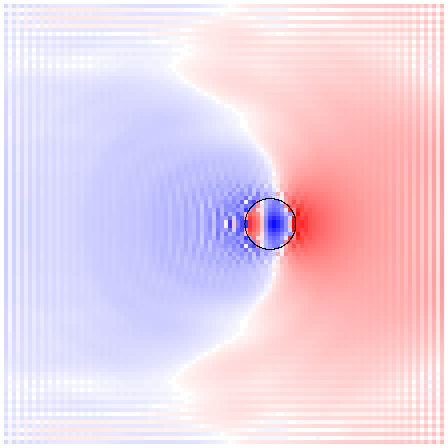
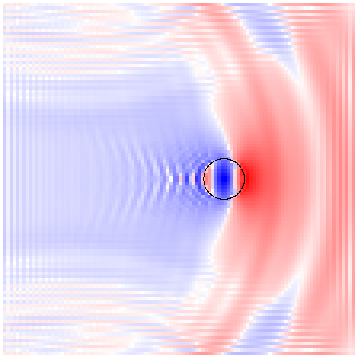
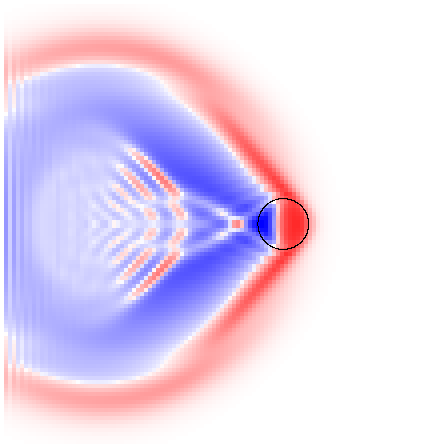

# heightfieldBEST — "Aqua Phase 7 SWE · Reference Visual Transplant"

| | |
|---|---|
| File | `01_CURRENT/JIT_M3_R22/public/originals/heightfieldBEST.html` (also uploaded directly) |
| SHA-256 | `9f7cd487f07873d5314eb25b9b16f9fad8f854627d6c641a783d61d2a1be5180` · 83,055 bytes · 1,082 lines |
| API | WebGL2, single HTML, CPU simulation on the main thread |
| Lineage | The Aqua pool line (this repo's ancestor) → Aqua Phase 7 "Occupancy SWE + FSS". It is the `BEST` in `BEST-JIT-M2/M3` and the physical core of the JIT Developer Lab. |
| Role in the consolidation | **Champion for the body → water reaction (wakes, displacement, cavity collapse).** |

## Verdict

BEST's wake is not a wake *model*. The moving body is a time-varying occupancy of the water columns, and that occupancy both *adds volume* and *blocks the flux*, so water has to physically go around, pile up in front of, and fall in behind the body. That is why it reads as a real reaction. It is the right coupling to carry forward.

Its wave propagation is non-dispersive shallow water. That is correct for long waves in a 1 m pool, but it cannot make a Kelvin wake in deep water. At subcritical speed it makes a bow swell and a trough, not transverse and divergent waves. Its splash stages (phases 2–5) are a careful design, but at default settings they never emit a particle.

**Keep the coupling, upgrade the propagation, and let the JIT lineage own the splash.**

## How to run

Serve the workspace's `public/` over HTTP, for example `python3 -m http.server 8095 --bind 127.0.0.1 --directory <unpacked>/01_CURRENT/JIT_M3_R22/public`. Then open `/originals/heightfieldBEST.html`.

Globals are reachable from the console: `setScene('sidefast'|'sideslow'|'drop'|'lift'|'still'|'impulse')`, `sphere`, `params`, `metrics`, `eta`, `vx`, `vz`.

The measured tows below override `updateAuto` for a constant-speed tow. Reproduce them with `node scripts/reference-capture.mjs docs/consolidation/scenes/best-tows.json`, which writes frames, top-view field maps and a receipt. A re-run gives field ranges of 0.085 / 0.352 / 0.027 m, matching the images below to about 3 %.

## Domain and time stepping

- Grid `N = 112`, pool `SZ = 12 m`, `DX = 0.107 m`, still depth `H = 1 m`, `g = 9.81`.
- `SUB = 3` substeps per frame, with frame `dt ≤ 0.033 s`.
- Collocated grid: η, u, v at cell centres, central differences.
- Sphere: radius 0.68 m, centre height `y = 0.12` (about 41 % submerged). Motion is prescribed (`updateAuto`); the mass slider does not drive dynamics.

## The body → water coupling (the part that makes it real)

Per column `i`, with the free surface η and the floor at `−H`:

1. **Solid occupancy σ.** This is the height of solid inside the *wet* part of the column:
   `σ = max(0, min(y_top, max(η, −H)) − max(y_bot, −H))`,
   where `y_bot/top = c_y ∓ √(r² − d²)`. So a sphere above the water occupies nothing, and a half-submerged one occupies only its wet cap (`computeObstacle`).
2. **Swept occupancy.** The body path between frames is sub-sampled (up to 24 samples at `DX/3` spacing). `transit = max(0, σ_swept − max(σ_now, σ_prev))` captures water the body passed through within the frame, so fast bodies don't tunnel.
3. **Continuity source.** `src = Δσ + 0.62·transit`. When `Δσ < 0` (the body leaves the column), an extra `+0.55·Δσ·releaseGain` pulls water into the opening void. The source is applied as `η += 0.38·volumeGain·src`.
4. **Flux blocking (the key difference from the Wallace pool and THALASSA's T3 tiles).** The liquid depth `m = H + η − σ` enters both momentum and continuity:
   - momentum: `u ← (u − g·c²·∂η/∂x·dt·clamp(m/H, 0.05, 1.6))·damping`, so nearly blocked columns don't accelerate like open water;
   - continuity: `η ← η − dt·∇·(m·u)`, so the *flux* through an occupied column shrinks with the solid there.

   Water can't flow through the body, so it goes around it. Bow pile-up, shoulder waves and the trailing hole all come out of this.
5. **Boundary momentum ring.** In a ring of width about `0.42 r` around the body:
   - front compression: `push·rel⁺·0.95`;
   - rear suction: `push·rel⁻·0.34`;
   - tangential shoulder flow: `0.18`;
   - where `src > 0`, a share of body velocity: `0.18·src`.
6. **Void collapse.** For `src < −0.002`, η drops and inflow points toward the void. Water falls in behind a lifting or leaving body instead of sticking to it.

Compared with the Wallace pool (and THALASSA's `TILE_SOURCE` capacity source), (1)–(3) are the same idea: Δ displaced volume. BEST adds (4) blocking, (5) directional momentum and (6) void collapse. Those three are what make it look like a real reaction.

## Wave propagation

Linearised shallow water:
- `∂u/∂t = −g·c²·∇η·(m/H)`;
- `∂η/∂t = −∇·(m u)`;
- damping 0.995 per substep plus `η·0.9996`;
- walls reflect with `wallLoss 0.82`;
- catastrophic clamps: |η| ≤ 0.85 m, |u| ≤ 4 m/s.

The wave speed is `√(gH) = 3.13 m/s` for every wavelength (non-dispersive).

Consequences, measured with constant-speed tows (sphere r = 0.68 m, H = 1 m; images are η top views, red up and blue down, with the body circled):

| Tow | Depth Froude `U/√(gH)` | What BEST produces | What real water does |
|---|---|---|---|
| 1.0 m/s | 0.32 | broad bow swell, shallow trough | Kelvin wake, 19.5° cusps, transverse λ = 2πU²/g = 0.64 m |
| 2.0 m/s | 0.64 | upstream dome, trough, odd–even ripples | Kelvin wake with λ ≈ 2.6 m transverse waves (intermediate depth) |
| 4.5 m/s | 1.44 | clean Mach V with half-angle ≈ asin(1/1.44) = 44°, hollow interior, closure chevrons | supercritical V: correct |

  

In the supercritical regime BEST is physically right. In the subcritical, dispersive regime it can't be, because it has no dispersion. That regime covers almost every boat, swimmer and floating object in deep water.

## Splash stages (phases 2–5)

This is a well-thought-out chain of diagnostic fields, all per column:

- **Director** (`dir`): a persistent sheet orientation (EMA 0.88), bent toward the sphere normal near contact (`wrap`), so the surface "remembers" it is wrapping a solid.
- **Sheet thickness** (EMA toward `0.035 + 0.42·occ + 1.15·|src| + 0.045·speed + 0.12·|η|`) and **fold** (slope, solid proximity, overturn `1 − dirY`, penetration, |σ̇|).
- **Underside clearance** (distance from the surface to the sphere skin) and **sheet pressure**: fold × proximity × thickness, plus trapped volume and opening.
- **Trap / release / collapse** from σ̇ < 0 (capacity opening). Release relaxes pressure and fold (detach), and collapse feeds the void-collapse forcing.
- **MPM risk** = f(fold, pressure, penetration, opening, speed). **Failed-sheet volume** = over-threshold risk × neck × (thickness, trap) × cell area. **JIT reservoir** `jitMpmVolume = max(leak·prev, failed)`.
- **Emission** (phase 5): `want = Σ (jitVol − 0.0009)·eject`. Each emission probes 18 random cells out of 12,544 and spawns ballistic parcels with local flow + radial ejection + lift. On re-entry a parcel adds `0.95·fb` to η and `0.55·fb·v` to momentum (`fb = feedback·vol`).

**Measured at defaults: zero particles.**
- Side-fast (6 s): peak `jitMpmVolume` 0.0005 m³ against the 0.0009 emission threshold; peak MPM risk 1.0.
- Drop: peak 0.0002 m³.

The chain saturates risk, but the volume export never crosses its threshold. Even if it did, 18 random probes in a 12,544-cell grid would find the few dozen active cells only occasionally. The design is sound, but the gain and threshold calibration and the spawn search are not. The JIT lineage (M2 → M3 → Lab) replaced this path.

## Body film (wetness)

The sphere carries a 72×36 lat-long film:
- deposit from contact band, relative speed and σ̇;
- drains downhill with side jitter, decays at the edges;
- drips from the underside above an adhesion threshold, spawning drip parcels;
- projects back onto the pool as `filmProjection`.

It's a good reduced model and a champion candidate for wet-body appearance. The Lab later made it metric, with a closed ledger residual of 1e-20 m³.

## Guards and filters (and what they cost)

- `applySolidCoreGuard`: blends η and u inside blocked or penetrated columns toward open neighbours, and damps sheet pressure and fold.
- `antiGridPass`: a 4-neighbour Laplacian blend weighted by openness. It is needed because the collocated central-difference scheme has odd–even (checkerboard) modes. They are visible in the tow images as striping behind the body and at the walls.
- Hard clamps, low-depth velocity damping, per-step η decay 0.9996.

None of these conserve volume. `MASS Δ` drifts (−0.013 m in side-fast). The Lab keeps these guards with counters.

## Rendering

The renderer is simple:
- a ray-traced refraction into an analytic box pool and sphere;
- a gradient sky;
- Schlick-like Fresnel `mix(0.045, 1, (1−cos)^3.2)`;
- sine-network "caustics";
- a Blinn highlight.

The water mesh is 168² with `contactDisplay` (SDF contact, which avoids cylinder footprints at the waterline). It looks clean, but it isn't a champion for optics: POSEIDON and T4R are.

## Carry forward / fix / improve

**Carry forward (champion):**
1. The occupancy σ, liquid depth `m = H + η − σ` gating flux and pressure acceleration: flow blocking.
2. Swept sub-sampled occupancy with the transit source.
3. Directional boundary momentum (front compression, rear suction, shoulder tangential).
4. Void collapse and release on σ̇ < 0.
5. Body film (lat-long, deposit, drain, drip), metric as in the Lab.
6. The inspector field set (σ, σ̇, penetration, fold, pressure, trap, release, collapse, risk, JIT volume): these are the right telemetry channels.

**Fix:**
1. Odd–even modes: use a staggered (MAC) grid or a flux-form upwind/HLL scheme instead of collocated central differences plus an anti-grid blur.
2. Conservation: make source and collapse terms exact volume transfers (the Lab's ledger already does this for carriers), and account for guards.
3. Spawn search: no random probing. Emit from every over-threshold cell deterministically, with the reservoir conserved.

**Improve (proposed):**
1. **Dispersive propagation with BEST's coupling.** Split the state into a bulk flow that runs BEST's occupancy SWE (blocking, displacement, collapse) and a surface-wave part that propagates with exact dispersion `ω² = gk·tanh(kH)`. THALASSA's eWave tiles already do the surface-wave part, and the bulk flow transports it (the splitting of Jeschke & Wojtan 2023, "Generalizing Shallow Water Simulations with Dispersive Surface Waves"). This gives Kelvin wakes at subcritical speed without losing the displacement reaction.
2. Couple the occupancy to *dynamic* bodies (buoyancy from the same σ integral: the displaced volume is Σσ·DX²), not only prescribed paths.
3. Calibrate the splash thresholds from physics (Froude/Weber at the contact line) instead of gains. See `../CORE_LAW.md`.
